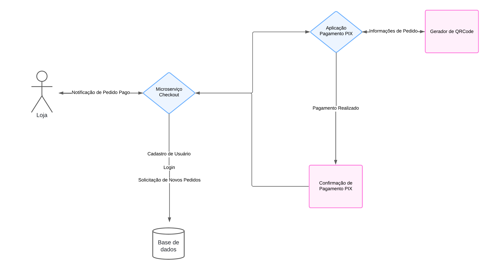

# Sistema de Integração de Pagamentos PIX

Este é um sistema de integração para processamento de pagamentos PIX em lojas virtuais. Ele permite a realização de pagamentos por PIX, desde o recebimento da requisição até a notificação da loja sobre o status do pagamento.

## Descrição do Projeto

Deseja-se realizar a integração do sistema de checkout de lojas virtuais com o sistema de transferência por PIX para realização de pagamento de compras realizadas. Para isso, será necessária a construção de um sistema de APIs online para recebimento de transações de pagamento das lojas, persistência em uma base local, envio para o sistema de processamento PIX, recebimento da confirmação de pagamento e notificação do pagamento realizado para a loja.

## Requisitos Funcionais

1. O sistema deverá receber da loja através da API uma requisição de pagamento por PIX com os dados de um pedido.
2. O sistema deverá enviar uma requisição de pagamento ao sistema de transferência PIX de acordo com os dados do pedido para recebimento de um QR Code para pagamento.
3. O sistema deverá retornar para a loja os dados recebidos para a geração de um QR Code para pagamento do pedido de forma síncrona através da API.
4. O sistema deverá receber do sistema de transferência PIX o status de pagamento de um pedido através da API de forma assíncrona e notificar a loja.
5. O sistema deverá registrar os dados do pedido e status de pagamento das transações em base de dados para controle, conciliação e consulta de todas as transações realizadas.

## Tecnologias Utilizadas

- Linguagem de Programação: [Java 17]
- Framework: [Spring boot]
- Banco de Dados: [SQL Server]
- Outras ferramentas e bibliotecas: [Kafka, JWT, zxing geração de QRCode]
